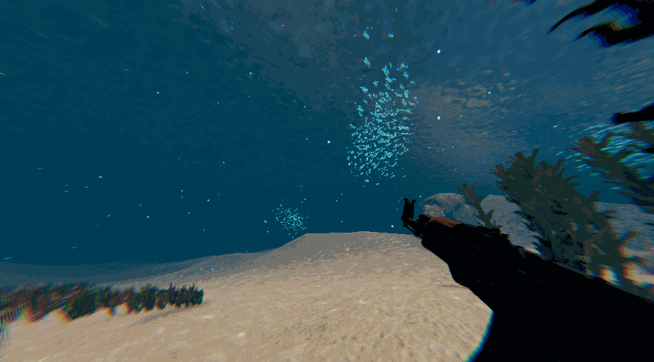

<h1>March Week 4</h1>

 

Added some cool pillars, and a grounding force (keeps player stuck to slopes when moving on them).

 

 

A better example of the edge stylization that was added.

 

Kinda forgot to update this, but I've added enemy AI, parrying, proper weapon switching, health bars, light edge stylization, made gun model take up more screen real estate.

 

<h1>January Week 4</h1>

Implemented hands with overlay camera in URP.

 

<h1>January Week 3</h1>

Implemented a rock ground attack, does no damage currently, but does knockback and looks cool.

 

<h1>December Week 4</h1>

Testing a stylization with pixelation, added dashing and improved movement.

 

<h1>November Week 1</h1>

Testing a stylization dither shader, might be a little extreme on the color banding and such for now.

 

Added coral details to the arena, provided by Quixel

 

Complete transition to the URP version of Unity 6, boosting performance by a significant margin.
Brightened the scene in general to make it look less bleak.

  

<h1>October Week 4</h1>

Adding different kelp lengths, and grass LODs for performance.

  

Experimenting with Quixel Megascan assets and boss rooms.

  

<h1>May Week 1</h1>

Experimenting with texturing, modified the kelp, ground cover additions, added crosshair.

  

<h1>April Week 2</h1>

Experimenting with reloading animations and weapon view models.

  

Adding some arms with IK, view model shader found here: https://forum.unity.com/threads/fps-sample-shader-graph-for-weapon-fov-not-working.576796/

  

Flocking fish, courtesy of https://github.com/abecombe/VFXGraphStudy. Had to change the update of the fish rendering away from the fixed update to a regular update loop to remove jitter.

  

<h1>April Week 1</h1>

Went for a more pixelated stylized look, and I'm actually really happy with how this turned out.

  

I'm Still not completely happy with the changes on the water and caustics, but the performance is so many leagues better than the typical HDRP water. It could definitely be possible to have the HDRP water as an option in the settings if the user desires.

  

Kelp is now offset by the world position for the wave function, added a color modifier, and fixed a weird problem with ambient occlusion on the kelp.

  

Testing the kelp shader works for now, but it will need to offset the wave function by world position to make them move differently from each other.

  

Adding a player controller to the game, is very barebones at this point.

  

Testing a different foliage method, this time using an opaque rendering method, preventing overdraw on the GPU.

  

Testing foliage with VFX graph, this method of drawing the alpha resulted in a ton of overdraw, increasing GPU times. Foam and ripples are added to enhance the ocean surface's look from below.

 

Also testing bubbles and terrain textures.

 

Testing bubbles, terrain textures, and post-processing effects.

 

Testing HDRP and the art style that is planned, and faking volumetric lighting with VFX graph

 

<h1>March Week 4</h1>

URP test, found to be difficult to add caustics to surfaces receiving main light, so URP is cut.

 

HDRP test with volumetric lighting, overall underperformant so volumetrics were cut.

