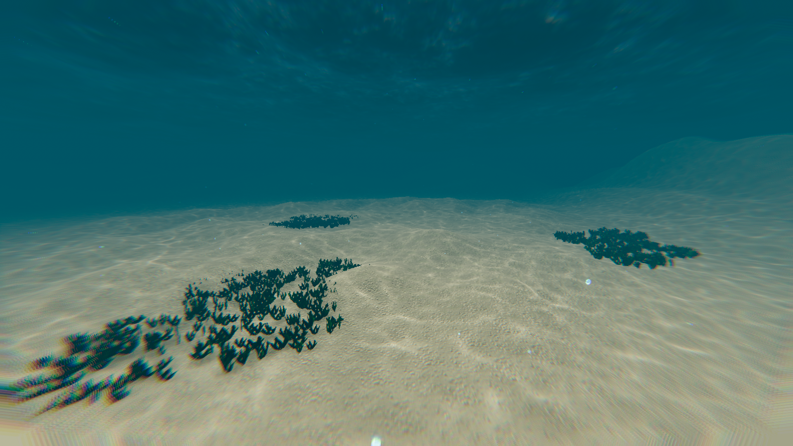
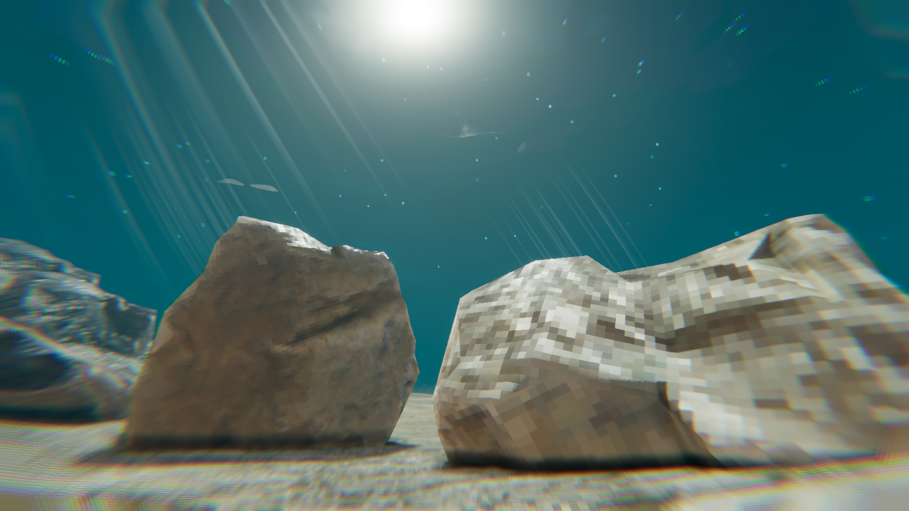
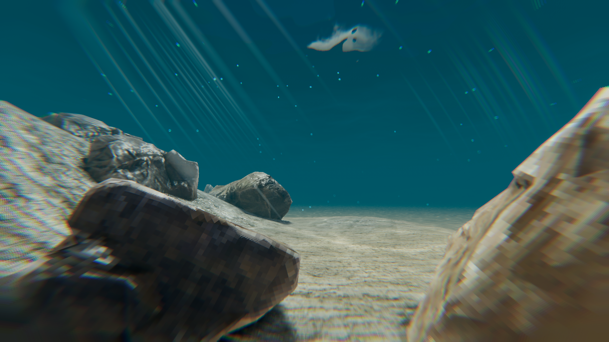
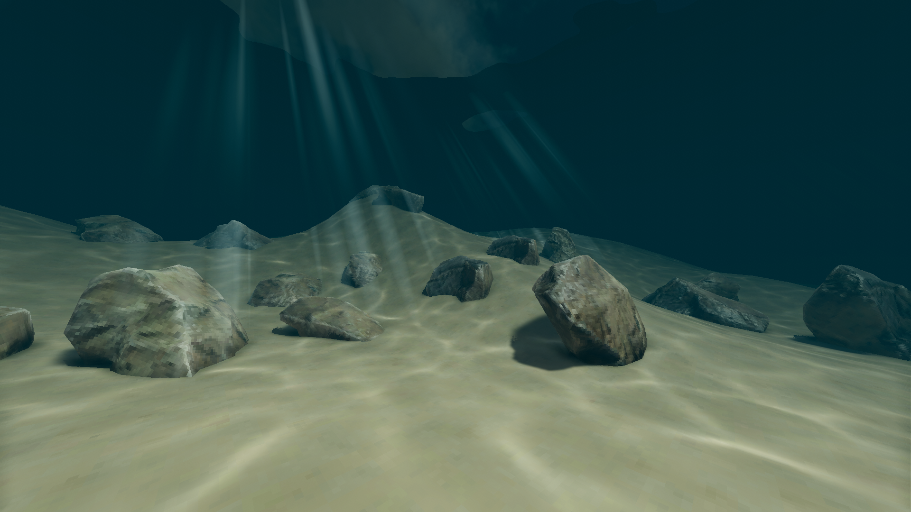
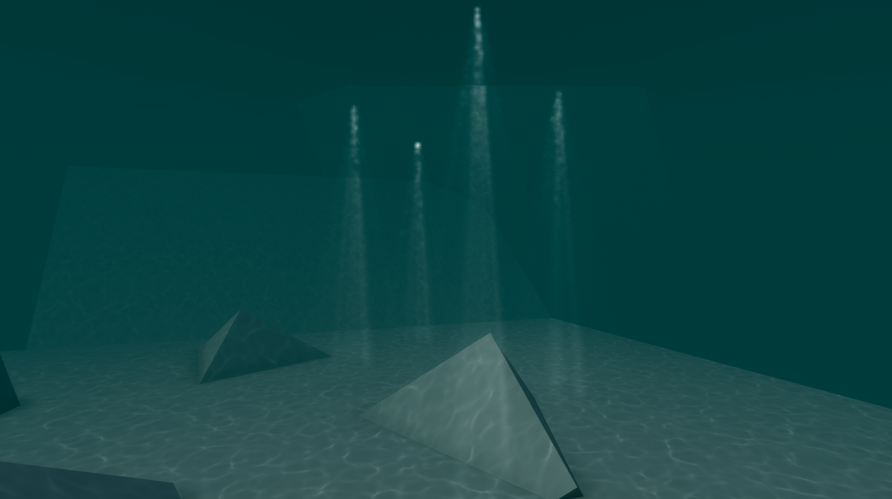

<h1>April Week 1</h1>

Testing HDRP and the artstyle that is planned, and faking volumetric lighting with VFX graph

<h1>March Week 4</h1>
URP test, found to be difficult to add caustics to surfaces receiving main light, so URP is cut.

HDRP test with volumetric lighting, overall underperformant so volumetrics were cut.

